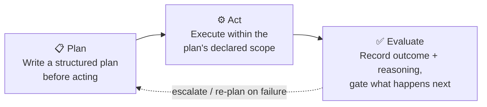
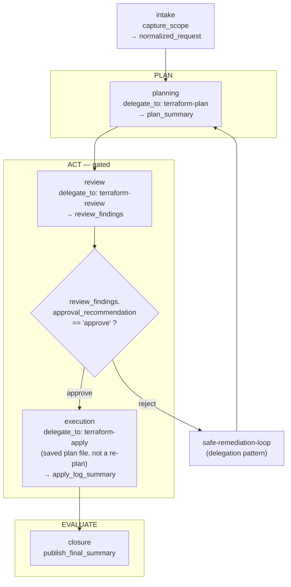
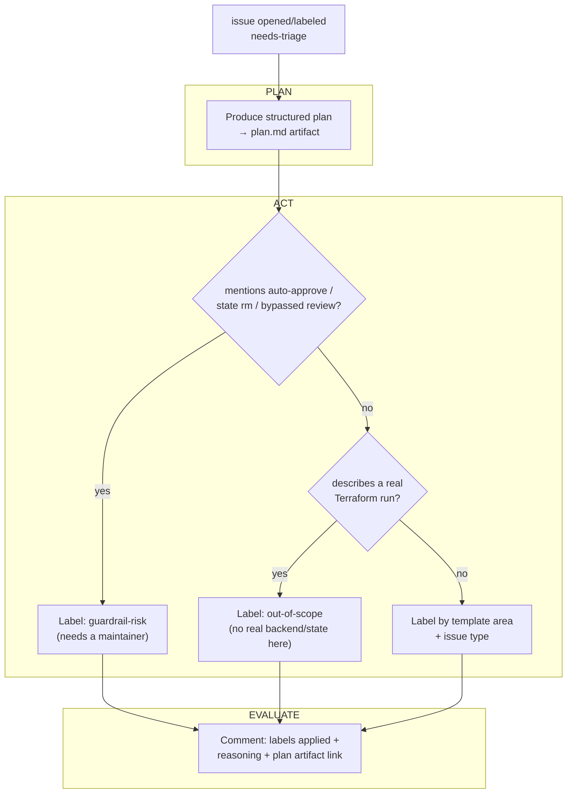

# Plan → Act → Evaluate

This kit uses the same three-stage shape everywhere an agent acts on its own: write a
structured plan before touching anything, act within that plan's declared scope, then
evaluate and record what happened before anything downstream can rely on it. Two concrete
instances of it live in this repo.

## The generic shape

## Instance 1: Terraform change lifecycle

[`templates/orchestration/terraform-change-lifecycle.yaml`](templates/orchestration/terraform-change-lifecycle.yaml),
executed by the agents in [`templates/agents/`](templates/agents/).

Guardrails this preserves (from
[`.github/copilot-instructions.md`](.github/copilot-instructions.md)):

- **Plan before apply, always** — `execution` requires both `plan_summary` and
  `review_findings`; there's no route that skips straight to apply.
- **Apply is gated on explicit approval** — the `Gate` diamond, not a silent pass-through.
- **Applies run against the saved plan file**, not a re-planned target.
- **Partial failures escalate**, they don't auto-retry — a rejected/failed run re-enters
  through `safe-remediation-loop` (plan → review → apply again), never a bare re-apply.

## Instance 2: Issue triage

[`.github/workflows/agent-triage.yml`](.github/workflows/agent-triage.yml) — the same shape
applied to this repo's own issues instead of Terraform changes.

## Why the shape repeats

A plan artifact before every action and a recorded evaluation after every action bounds an
agent's blast radius and makes it reviewable, regardless of what it's actually doing —
changing infrastructure or triaging issues on the kit itself. See
[`.github/copilot-instructions.md`](.github/copilot-instructions.md) for the guardrails this
protects, and [`README.md`](README.md) for how each workflow maps onto `templates/`.
